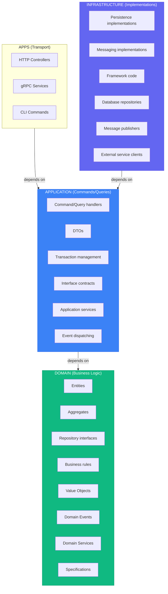
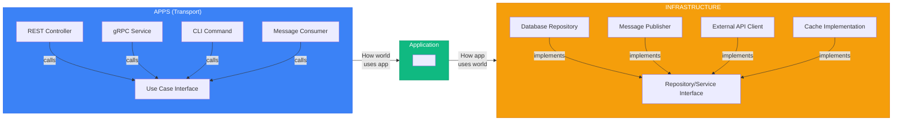

# Quick Reference Cheatsheet

> See [SKILL.md](../SKILL.md#sources) for full source list.

## Layer Summary

- Default structure for this skill: **vertical slices by aggregate**.
- In CQRS mode: commands/queries are dispatched through **Mediator**.



*Dependencies point inward*

---

## Quick Decision Trees

### "Where does this code go?"

```
Is it a business rule or constraint?
├── YES → Domain layer
└── NO ↓

Is it orchestrating a use case?
├── YES → Application layer
└── NO ↓

Is it dealing with external systems (DB, API, UI)?
├── YES → Infrastructure layer
└── NO → Reconsider; probably domain
```

### "Entity or Value Object?"

```
Does it have a unique identity that persists?
├── YES → Entity
└── NO ↓

Is it defined entirely by its attributes?
├── YES → Value Object
└── NO → Probably an Entity
```

### "Aggregate boundary?"

```
Must these objects change together atomically?
├── YES → Same aggregate
└── NO ↓

Can one exist without the other?
├── YES → Different aggregates (reference by ID)
└── NO → Probably same aggregate
```

### "Domain Service or Entity method?"

```
Does it naturally belong to one entity?
├── YES → Entity method
└── NO ↓

Does it require multiple aggregates?
├── YES → Domain Service
└── NO ↓

Is it stateless business logic?
├── YES → Domain Service
└── NO → Reconsider placement
```

---

## Common Patterns Quick Reference

Implementation templates were moved to avoid duplication:

- Tactical DDD templates: [DDD-TACTICAL.md](DDD-TACTICAL.md)
- CQRS + handler flow (mediator): [CQRS-EVENTS.md](CQRS-EVENTS.md)
- Layer placement examples: [LAYERS.md](LAYERS.md)

---

## Interface Naming Conventions

| Type | Pattern | Examples |
|------|---------|----------|
| Use case interface | `I{Action}UseCase` | `IPlaceOrderUseCase`, `IGetOrderUseCase` |
| Repository interface | `I{Resource}Repository` | `IOrderRepository`, `IProductRepository` |
| Service interface | `I{Action}Service` | `IPaymentService`, `INotificationService` |
| Gateway interface | `I{Resource}Gateway` | `IPaymentGateway`, `IShippingGateway` |

---

## Common Anti-Patterns

| Anti-Pattern | Problem | Solution |
|--------------|---------|----------|
| Anemic Domain | Entities are just data bags | Put behavior in entities |
| Repository per table | One repo per DB table | One repo per aggregate |
| Fat Use Cases | Business logic in handlers | Move to domain |
| Leaky Abstraction | Domain depends on ORM | Keep domain pure |
| God Aggregate | One massive aggregate | Split into smaller ones |
| Cross-Aggregate TX | Modifying multiple in one TX | Use domain events |
| Direct Layer Skip | Controller → Repository | Go through application layer |
| Premature CQRS | Adding complexity early | Start simple, evolve |
| Event Proliferation | Too many fine-grained events | May signal context boundary |

---

## Dependency Rules Matrix

|  | Domain | Application | Infrastructure |
|--|--------|-------------|----------------|
| **Domain** | ✅ | ❌ | ❌ |
| **Application** | ✅ | ✅ | ❌ |
| **Infrastructure** | ✅ | ✅ | ✅ |

✅ = Can depend on
❌ = Cannot depend on

---

## Hexagonal Quick Reference



---

## When to Use / Skip

Use/skip criteria are centralized in [../SKILL.md](../SKILL.md). Keep this cheatsheet focused on quick placement and naming.

---

## File Naming Conventions

```
src/
├── order/
│   ├── domain/
│   │   ├── order.ts                    # Aggregate root
│   │   ├── order_item.ts               # Entity
│   │   ├── value_objects.ts            # OrderId, Money, etc.
│   │   ├── events.ts                   # OrderCreated, etc.
│   │   ├── repository.ts               # IOrderRepository
│   │   ├── services.ts                 # Domain services
│   │   └── errors.ts                   # OrderError, etc.
│   ├── application/
│   │   ├── commands/place_order/
│   │   │   ├── command.ts              # PlaceOrderCommand
│   │   │   └── handler.ts              # PlaceOrderHandler
│   │   └── queries/get_order/
│   │       ├── query.ts
│   │       └── result.ts
│   └── infrastructure/
│       ├── persistence/postgres/
│       │   ├── order_repository.ts     # PostgresOrderRepository
│       │   └── mappers/order_mapper.ts # Domain <-> DB mapping
│       ├── persistence/mysql/
│       │   └── my_sql_order_repository.ts # MySqlOrderRepository
│       ├── messaging/
│       └── external/
└── shared/
    ├── domain/
    ├── application/
    └── infrastructure/

apps/
└── Api/
    ├── controllers/
    └── routes/
```

---

## Resources

### Books
- Clean Architecture (Robert C. Martin, 2017)
- Domain-Driven Design (Eric Evans, 2003)
- Implementing Domain-Driven Design (Vaughn Vernon, 2013)
- Hexagonal Architecture Explained (Alistair Cockburn, 2024)
- Get Your Hands Dirty on Clean Architecture (Tom Hombergs, 2019)

### Reference Implementations
- Go: [bxcodec/go-clean-arch](https://github.com/bxcodec/go-clean-arch)
- Rust: [flosse/clean-architecture-with-rust](https://github.com/flosse/clean-architecture-with-rust)
- Python: [cdddg/py-clean-arch](https://github.com/cdddg/py-clean-arch)
- TypeScript: [jbuget/nodejs-clean-architecture-app](https://github.com/jbuget/nodejs-clean-architecture-app)
- .NET: [jasontaylordev/CleanArchitecture](https://github.com/jasontaylordev/CleanArchitecture)
- Java: [thombergs/buckpal](https://github.com/thombergs/buckpal)

### Official Documentation
- https://blog.cleancoder.com/uncle-bob/2012/08/13/the-clean-architecture.html
- https://alistair.cockburn.us/hexagonal-architecture/
- https://www.domainlanguage.com/ddd/
- https://martinfowler.com/tags/domain%20driven%20design.html
