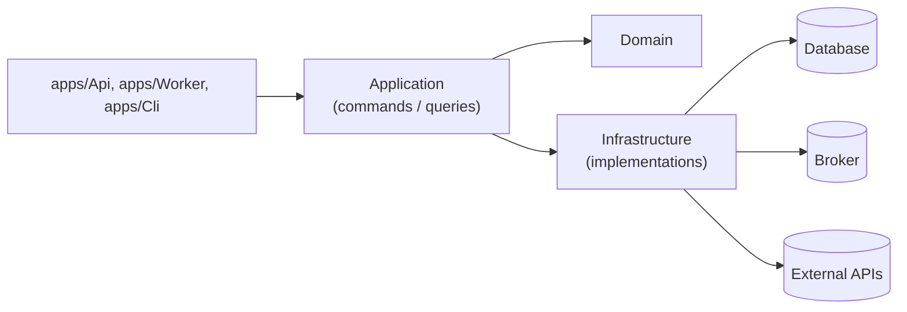

# Hexagonal Architecture (Boundaries & Implementations)

> Sources:
> - [Hexagonal Architecture](https://alistair.cockburn.us/hexagonal-architecture/) — Alistair Cockburn (2005)
> - [Hexagonal Architecture Explained](https://openlibrary.org/works/OL38388131W) — Alistair Cockburn & Juan Manuel Garrido de Paz (2024)
> - [Hexagonal Architecture Pattern](https://docs.aws.amazon.com/prescriptive-guidance/latest/cloud-design-patterns/hexagonal-architecture.html) — AWS

## Core Concept

Hexagonal architecture isolates business logic from frameworks and external systems through **stable interfaces** and **replaceable implementations**.

- Application depends on domain interfaces
- Infrastructure implements domain/application interfaces
- Transport belongs to `apps/`, not to `src/{aggregate}/infrastructure`
- Framework persistence pieces (`DbContext`, DB sessions/contexts, `Eloquent`) belong only to `src/{aggregate}/infrastructure/**`



---

## Mandatory Structure

```text
src/
├── order/
│   ├── domain/
│   │   ├── order.ts
│   │   ├── events.ts
│   │   └── repository.ts                 # IOrderRepository
│   ├── application/
│   │   ├── commands/
│   │   │   └── place_order/
│   │   │       ├── command.ts
│   │   │       ├── handler.ts
│   │   │       └── use_case.ts          # IPlaceOrderUseCase
│   │   └── queries/
│   │       └── get_order/
│   │           ├── query.ts
│   │           ├── handler.ts
│   │           └── result.ts
│   └── infrastructure/
│       ├── persistence/
│       │   ├── mysql/
│   │       │   └── my_sql_order_repository.ts
│       │   └── postgres/
│       │       └── postgres_order_repository.ts
│       ├── messaging/
│       │   └── rabbitmq_event_publisher.ts
│       └── external/
│           └── stripe_payment_gateway.ts
└── shared/
    ├── domain/
    ├── application/
    └── infrastructure/

apps/
├── Api/
│   ├── controllers/
│   ├── routes/
│   └── bootstrap.ts
├── Worker/
└── Cli/
```

Rules:
1. `application` only contains `commands` and `queries` workflows.
2. `src/{aggregate}/infrastructure` contains implementations only (no controllers).
3. Transport concerns (HTTP/gRPC/GraphQL/CLI) are under `apps/`.
4. Persistence implementations are grouped under `infrastructure/persistence/*`.
5. Framework-specific persistence APIs (`DbContext`, `Eloquent`, ORM context/session) are restricted to `infrastructure`.

---

## Interface & Implementation Example

```typescript
// src/order/domain/repository.ts
export interface IOrderRepository {
  findById(id: OrderId): Promise<Order | null>;
  save(order: Order): Promise<void>;
}

// src/order/infrastructure/persistence/mysql/my_sql_order_repository.ts
export class MySqlOrderRepository implements IOrderRepository {
  // Allowed here: DbContext/Eloquent/ORM-specific objects
  async findById(id: OrderId): Promise<Order | null> {
    return null;
  }

  async save(order: Order): Promise<void> {
    // persist
  }
}
```

---

## Application Example (Commands/Queries)

```typescript
// src/order/application/commands/place_order/use_case.ts
export interface IPlaceOrderUseCase {
  execute(command: PlaceOrderCommand): Promise<OrderId>;
}

// src/order/application/commands/place_order/handler.ts
export class PlaceOrderHandler implements IPlaceOrderUseCase {
  constructor(private readonly orderRepository: IOrderRepository) {}

  async execute(command: PlaceOrderCommand): Promise<OrderId> {
    const order = Order.create(OrderId.generate(), command.customerId);
    await this.orderRepository.save(order);
    return order.id;
  }
}

// src/order/application/queries/get_order/handler.ts
export class GetOrderHandler {
  constructor(private readonly orderRepository: IOrderRepository) {}

  async execute(query: GetOrderQuery): Promise<OrderDTO | null> {
    const order = await this.orderRepository.findById(OrderId.from(query.orderId));
    return order ? OrderMapper.toDTO(order) : null;
  }
}
```

---

## App Transport Example

```typescript
// apps/Api/controllers/order_controller.ts
export class OrderController {
  constructor(private readonly mediator: IMediator) {}

  async create(req: Request, res: Response): Promise<void> {
    const id = await this.mediator.send<OrderId>({
      type: 'PlaceOrderCommand',
      customerId: req.user.id,
      items: req.body.items,
    });

    res.status(201).json({ id });
  }
}
```

`apps/Api` orchestrates transport and delegates to application commands/queries through mediator.

---

## Benefits

1. Domain remains framework-independent.
2. Infrastructure is organized by concern (`persistence`, `messaging`, `external`).
3. Transport is isolated in `apps/*`, enabling multiple app front doors.
4. Application remains explicit through command/query workflows.
