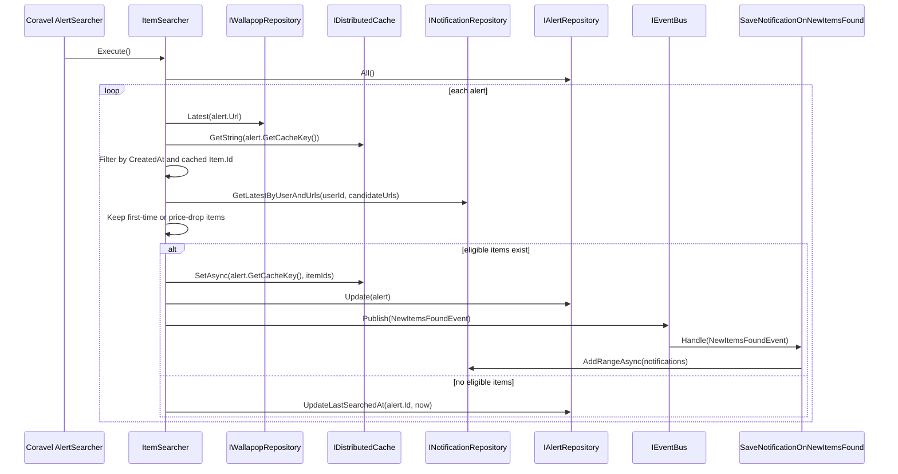

# Design: Avoid Double Notifications and Re-notify on Price Drops

## Technical Approach

Move item eligibility into a deterministic persistence-backed decision inside `ItemSearcher`, while preserving existing responsibilities:
- `ItemSearcher` decides which items are eligible for `NewItemsFoundEvent`.
- Notification subscribers (`SaveNotificationOnNewItemsFound`, push/web handlers) keep formatting, persistence, and delivery behavior.

The search flow remains the same at high level (fetch alerts, fetch Wallapop items, publish domain events), but eligibility now combines:
1. existing time-based filter (`item.CreatedAt >= alert.CreatedAt`),
2. cache lookup/update by `Item.Id` for fast short-circuiting,
3. authoritative lookup of last notified state by user and item URL/slug,
4. price-drop decision using `Item.Price.CurrentPrice < lastNotifiedCurrentPrice`.

## Architecture Decisions

### Decision: Persistence-backed notification state is the source of truth

**Choice**: `ItemSearcher` queries `INotificationRepository` in batch for latest notified snapshot per candidate URL and user.
**Alternatives considered**: cache-only dedup and cache+price metadata.
**Rationale**: cache can evict/reset and cannot guarantee historical correctness; notifications history is durable and aligns with business intent.

### Decision: Preserve service boundaries and event responsibilities

**Choice**: Keep event emission in `ItemSearcher`; keep notification creation/sending in `NewItemsFoundEvent` subscribers.
**Alternatives considered**: moving notification formatting or persistence into `ItemSearcher`.
**Rationale**: avoids leaking notification concerns into alerts application service; keeps current bounded-context responsibilities stable.

### Decision: Use URL derived from `Item.WebSlug` as lookup key, keep cache keyed by `Item.Id`

**Choice**: For DB history checks, derive candidate URL using `Url.CreateFromSlug(item.WebSlug).Value`; for run-level cache, continue read/write by item ids (`Item.Id`) under `alert.GetCacheKey()`.
**Alternatives considered**: DB lookup by `Item.Id` and replacing cache strategy entirely.
**Rationale**: persisted notifications already store URL, not Wallapop item id; cache-by-id is already integrated and cheap for repeated polls.

### Decision: Price-drop logic compares current persisted-notified price vs current candidate price

**Choice**: item is eligible when never notified OR `item.Price != null && item.Price.CurrentPrice < snapshot.LastNotifiedCurrentPrice`.
**Alternatives considered**: using `Item.Price.PreviousPrice` or allowing equal-price re-notify.
**Rationale**: proposal requires explicit comparison against last notified price and suppression of unchanged/higher price duplicates.

## Data Flow

### Sequence Diagram



### Eligibility and cache/update rules

```text
1) Build wallapop candidates for an alert.
2) Read cache bucket alert.GetCacheKey() => set of Item.Id already seen in recent runs.
3) Pre-filter candidates:
   - keep items created after alert.CreatedAt
   - skip items present in cache (Item.Id hit)
4) Build URLs from remaining candidates:
   url = Url.CreateFromSlug(item.WebSlug).Value
5) Batch query latest notified snapshot by (alert.UserId, url).
6) Decide eligibility per item:
   - No snapshot => eligible (first-time notification)
   - Snapshot exists and item.Price.CurrentPrice < snapshot.LastNotifiedCurrentPrice => eligible (price drop)
   - Otherwise => not eligible
7) If at least one eligible item:
   - emit NewItemsFoundEvent with eligible items only
   - update cache with current wallapop Item.Id list for alert
8) If no eligible items:
   - only touch last searched timestamp
```

## File Changes

| File | Action | Description |
|------|--------|-------------|
| `backend/src/Alerts/Application/SearchNewItems/ItemSearcher.cs` | Modify | Inject `INotificationRepository`, add batch history lookup and price-drop eligibility while preserving event publication behavior and cache-by-id update. |
| `backend/src/Notifications/Domain/INotificationRepository.cs` | Modify | Add contract to retrieve latest notified snapshot per user and candidate URLs/slugs. |
| `backend/src/Notifications/Domain/Models/LastNotifiedItemSnapshot.cs` | Create | Small read model/DTO for `(Url, LastNotifiedCurrentPrice, NotifiedAt)` projection used by `ItemSearcher`. |
| `backend/src/Notifications/Infrastructure/Percistence/NotificationRepository.cs` | Modify | Implement single-query grouped lookup for latest notification per URL for one user and map to snapshot DTO. |
| `backend/src/Shared/Infrastructure/Percistence/EntityFramework/Configurations/NotificationConfiguration.cs` | Modify | Add index to optimize lookup path, likely composite on `(UserId, Url, CreatedAt)`. |
| `backend/tests/Alerts/2-Application/SearchNewItems/ItemSearcherTest.cs` | Modify | Replace cache-duplicate-only assertion path with first-time, unchanged/higher price suppression, and price-drop re-notification scenarios. |
| `backend/tests/Notifications/2-Application/SaveOnNewItemsFound/SaveNotificationOnNewItemsFoundTest.cs` | Verify/Modify | Ensure subscriber behavior remains unchanged when receiving already-filtered event items. |

## Interfaces / Contracts

```csharp
namespace Wallanoti.Src.Notifications.Domain.Models;

public sealed record LastNotifiedItemSnapshot(
    string Url,
    double LastNotifiedCurrentPrice,
    DateTime NotifiedAt
);
```

```csharp
namespace Wallanoti.Src.Notifications.Domain;

public interface INotificationRepository
{
    Task SaveAsync(Notification notification);
    Task AddRangeAsync(IEnumerable<Notification> notifications);
    Task<IEnumerable<Notification>?> ByUserId(long userId, CancellationToken cancellationToken);

    Task<IReadOnlyDictionary<string, LastNotifiedItemSnapshot>>
        GetLatestByUserAndUrls(long userId, IReadOnlyCollection<string> urls, CancellationToken cancellationToken = default);
}
```

Eligibility helper inside `ItemSearcher` (internal/private):

```csharp
private static bool IsEligibleByPriceDrop(Item item, LastNotifiedItemSnapshot? snapshot)
{
    if (snapshot is null) return true;
    if (item.Price is null) return false;

    return item.Price.CurrentPrice < snapshot.LastNotifiedCurrentPrice;
}
```

## Testing Strategy

| Layer | What to Test | Approach |
|-------|-------------|----------|
| Unit | `ItemSearcher` eligibility matrix (first-time, cached-id duplicate, unchanged price, higher price, lower price) | Add/adjust `ItemSearcherTest` with mocked `INotificationRepository` snapshots and explicit assertions on published `NewItemsFoundEvent` items. |
| Unit | Notification repository latest snapshot query behavior | Add repository tests (or focused integration-style test over EF in-memory/sqlite) validating one latest row per URL and user. |
| Integration | Event boundary remains intact | Verify `SaveNotificationOnNewItemsFound` still creates notifications and events from incoming `NewItemsFoundEvent` without eligibility logic. |
| Regression | Existing error path (Wallapop failure owner push alert) | Keep current test to ensure exception notification behavior is unchanged. |

## Migration / Rollout

No migration required for correctness. Optional performance migration: add DB index for `(UserId, Url, CreatedAt)` via EF migration if query plan indicates scan under production load.

Rollout plan:
1. Ship code path and tests.
2. Observe scheduled search latency and DB query timings.
3. Apply index migration if needed.

## Open Questions

- [ ] Should cache-write continue storing all fetched Wallapop ids or only ids from eligible items after persistence checks?
- [ ] Should `item.Price == null` always be treated as non-eligible for re-notify, or is there a fallback rule needed for legacy data?
- [ ] Is URL normalization needed (trailing slashes/query params) before repository lookup, or is `Url.CreateFromSlug` sufficient for all stored notifications?
