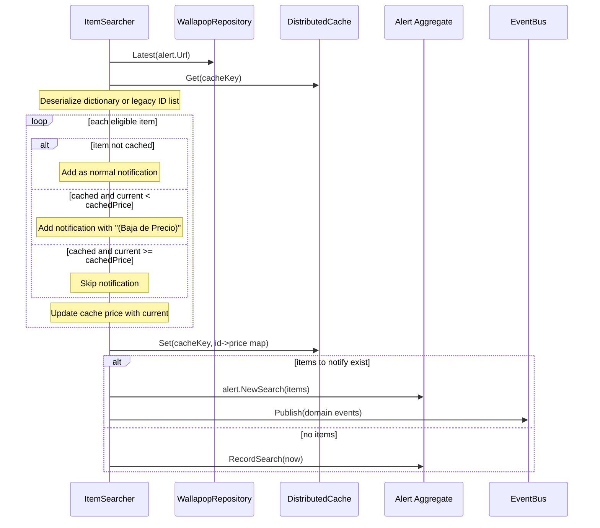

# Design - duplicated-notification-codex

## Decision
Use `Dictionary<string, double?>` as cache model in `ItemSearcher`:
- key: `Item.Id`
- value: last known processed current price
- nullable value supports legacy IDs with unknown historical price.

## Rationale
- Enables explicit business rule check `current < cached`.
- Keeps cache lookup O(1) by item identity.
- Allows backward compatibility without a migration script.

## Flow

## Key implementation notes
- Price-drop suffix constant: `(Baja de Precio)`.
- Suffix is appended once per generated notification title.
- Cache update runs after evaluation so dropped prices are persisted immediately.
- Legacy cache `List<string>` is converted to dictionary with null price values.
